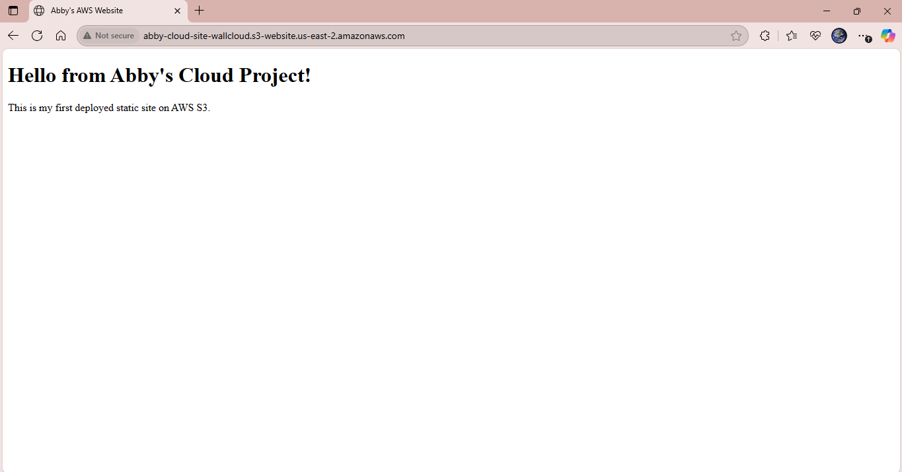

# aws-s3-static-site
Host a static website using AWS S3 and CloudFront
# AWS Static Website Hosting

This project demonstrates how to host a static website using **Amazon S3** and serve it globally with **CloudFront**.

## 🛠️ Tools Used
- AWS S3
- AWS CloudFront
- GitHub
- Public bucket policies
- Website configuration

## 🚀 Features
- Static HTML/CSS site deployment
- S3 website hosting
- CloudFront CDN setup
- Optional custom domain (future upgrade)

## 📸 Screenshot

## 📁 Files
- `index.html` – Simple static website
- `README.md` – Project documentation

## 🔐 Security Notes
IAM roles and bucket policies follow AWS security best practices.

## 📎 License
MIT License
